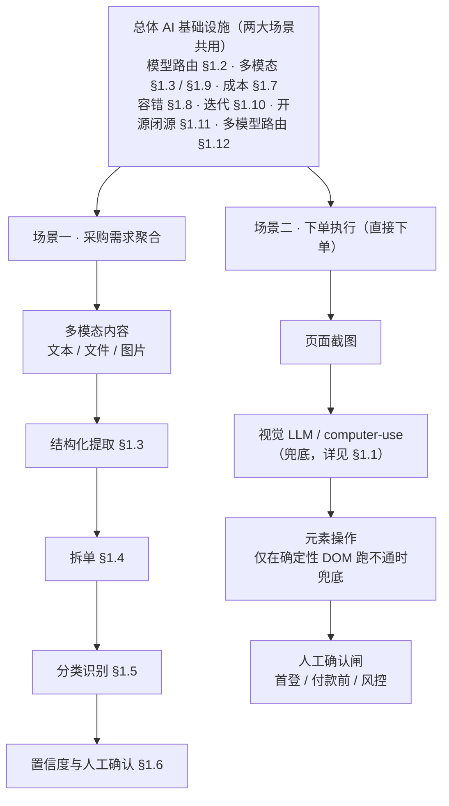

# 代采平台 · 总体 AI 方案设计文档（独立文档）

> 版本：v1.2（由《设计方案_采购需求聚合子系统.md》「§6 AI 方案」章节独立抽出，并扩展为覆盖采购需求聚合与下单执行两大平行子系统的总体 AI 方案；v1.2 将文档编号由 §6.x 重排为 **§1.x**，并把原「应用场景二：下单执行」的 AI 内容并入 §1.1 总览，消除「独立文档顶层从 §6 起」与「有应用场景二却无应用场景一」两处结构性错误）
> 定位：代采平台**总体 AI 方案文档**，服务于其下两大平行子系统（采购需求聚合、下单执行）；集中定义模型选型、多模态处理、成本、容错、迭代、开源闭源、多模型路由等共用 AI 基础设施，并落到两大应用场景；独立可评审、可演进
> 说明：本文档为独立文档，编号自 **§1** 起；§1.1 总览含两大应用场景（含下单执行的 AI 要点），§1.2–§1.12 为总体能力与场景一（采购需求聚合）的具体章节。

---

## 1. 代采平台总体 AI 方案

本文档集中定义代采平台两大平行子系统共用的 AI 基础设施，并落到具体应用场景。AI 不是一次性黑盒，而是管线中的处理环节。

### 1.1 总览：总体 AI 方案与两大应用场景

**两大应用场景**
- **场景一 · 采购需求聚合（采集层）**：多模态需求 → 结构化提取 → 拆单 → 分类识别（详见 §1.3–§1.6、§1.8）。
- **场景二 · 下单执行（直接下单）**：已确认子单在第三方电商自动「选品 → 填单 → 下单 → 付款」；混合架构为「确定性 DOM 层（Playwright 主力）+ AI 视觉层（兜底）+ 人工确认闸（合规底线）」；其 AI 部分（视觉兜底）具体为：
  - **为什么需要 AI（视觉兜底）**：确定性 DOM 层能跑通时（稳定选择器、固定表单）**不调 AI**——控成本、控不确定性；当页面动态、无稳定选择器、或遇到滑块 / 简单验证码类元素时，确定性层失效，调用 **视觉 LLM / computer-use** 识别页面元素并操作（呼应 §1.9 视觉 LLM 路线 A）。即：在场景一（采集）视觉 LLM 是图片输入的**默认通道**；在场景二（执行）它是确定性 DOM 跑不通时的**兜底通道**——两者一致，均把视觉能力作为核心，不依赖独立 OCR。
  - **技术实现要点**：`ai_vision.py` 封装视觉 LLM / computer-use 调用（输入截图、输出「元素坐标 + 操作意图」）；模型路由复用 §1.2 / §1.12（视觉兜底可配独立强模型，按 `operation` 在 config 路由）；成本控制复用 §1.7（每次兜底调用写 `ai_api_cost(operation=vision_fallback)`）；容错复用 §1.8（视觉调用失败 → 回退人工，不阻断其他步骤）。
  - **AI 治理边界：人工确认闸**：首登授权、付款前确认、风控转人工——关键节点必须人工把关（详见《设计方案_下单执行子系统.md》§5.3）；原则：AI 不无人监管地动钱，人工闸是合规底线，即便视觉层再强也不绕过。

**共用 AI 基础设施（与子系统解耦、独立演进）**
- 模型选型与路由（§1.2）：按 operation 在 config 指定模型，效果 / 成本权衡
- 多模态处理（§1.3 输入归一化、§1.9 图片选型）：文本 / 文件 / 图片统一为结构化上下文
- 成本控制（§1.7）、容错降级（§1.8）、模型迭代与语料（§1.10）、开源 vs 闭源（§1.11）、多模型路由（§1.12）



场景一为三段式管线 `多模态内容 → 结构化提取 → 拆单 → 分类识别`；场景二为 `页面截图 → 视觉识别 → 元素操作`。每一步调用结束即写一行 `ai_api_cost`。

### 1.2 模型选型与路由（可配置）
- **文本/结构化提取 + 分类**：通用大模型（支持 JSON 结构化输出的对话模型），通过 API 调用
- **图片**：默认采用**路线 A（视觉 LLM）**——将 `ocr_backend` 实现为视觉多模态模型，一步完成识图与要素抽取（详见 §1.9）。独立 OCR（路线 B）仅作为视觉 LLM 失败 / 超成本 / 超长扫描件时的**可插拔降级后端**，本期不实现，亦不主动作为默认路径（避免双链路复杂度与 Tesseract 中文表格识别误差）。
- **模型路由**：在 `config` 中按 `operation` 指定模型（如简单文本用便宜模型，图片/复杂单据用强模型），便于在**效果与成本之间权衡**
- 模型名称、endpoint、API key 全部走配置，不硬编码，方便切换供应商或升级模型

### 1.3 ① 内容提取（Extraction）
**目标**：把非结构化的多模态内容，转成统一的结构化 JSON。

- **System Prompt**：定义角色（"你是代采平台的采购需求解析助手"）+ 输出 JSON Schema 约束（字段名、类型、枚举、必填项）
- **Structured Output**：使用模型的 **JSON 模式 / Function Calling / response_format** 强制返回合法 JSON，避免自由文本、便于程序解析
- **Few-shot 示例**：附 1–2 个真实样本提升准确率
  - 样本 A：微信群"26FW 制作费 40000，已付，收款账户：刘鸿瑞 招行……" → 提取出代付款、金额、收款账户
  - 样本 B：Excel 排风扇清单一行 → 提取出品名/型号/数量/单价/小计/地址/快递
- **输入上下文组装**：
  - 文本 → `raw_text`
  - 文件 → 解析后的 markdown / 表格文本（由 openpyxl / markitdown 等非 LLM 模块产出）
  - 图片 → `ocr_text`（由视觉 LLM 后端〔路线 A〕产出的文本；字段名沿用 `ocr_text` 仅表示"图片转出的文本"，来源即 §1.9 的路线 A 后端）
  - 多形态共存 → 拼接为一段上下文，一次提取
- **输出 Schema（核心字段）**：
  ```json
  {
    "customer_hint": {"company_name": "...", "contact_name": "...", "phone": "..."},
    "items": [
      {"item": "排风扇", "model": "APB25", "qty": 2, "unit": "台",
       "spec": "...", "budget": 980, "category": "设备"}
    ],
    "total_amount": 4192.5,
    "deadline": "2026-08-10",
    "priority": "high",
    "business_type_signal": "代下单",
    "payer_hint": "platform",
    "confidence": 0.93
  }
  ```
- 一次消息 = 一次提取调用 → 记一行 `ai_api_cost(operation=extraction)`

### 1.4 ② 拆单（Splitting）
- 提取出的 `items[]` 按**商品**逐条展开；每条 item 结合「对应客户 + 消息时间」生成一个候选子单
- **唯一性**：`unique_key = hash(customer_id + item_name + time_bucket)`
  - 同客户不同时间同商品 → 不同 key → 不同子单
  - 不同客户同时间同商品 → 不同 key → 不同子单
  - 同客户同商品不同时间 → 不同 key → 不同子单
- 同一原始消息的全部子单归入**一个 `procurement_request`（父单）**，父单挂 `raw_content` / `source_id` / `parsed_at`
- 拆单本身可由 LLM 输出直接驱动（items 已是数组），也可加一次轻量 LLM 调用做"是否应再细分"的判定；实现上倾向**由提取结果直接展开 + 规则兜底**，以省 token

### 1.5 ③ 分类识别（Classification）
- **输入**：`raw_content` + 子单要素 + `customer.contract_term`
- **business_type**（代采路径）：代付款 / 代下单 / 代询价比价 / 全包
  - 代付款：已有供应商/订单，平台只付 → "已付""转账""收款账户"
  - 代下单：平台代为下单 → "帮我下单""采购清单""链接"
  - 代询价比价：先寻源比价 → "询价""比价""推荐供应商"
  - 全包：端到端流程
- **payer_type**（付款方归属）：customer（客户自付）/ platform（平台代付）
  - 优先采信合同 `default_payer_type`
  - 消息内容与合同冲突 → 置 `needs_review_flag`，**不强行覆盖**
- 可与提取**合并为一次调用**（多任务输出，省成本），或**分步调用**（更可控、便于按 operation 定位成本）。默认建议提取与分类分步，便于成本归因与失败重试

### 1.6 置信度与人工确认
- LLM 对每个子单返回 `confidence`（0–1）
- 约定阈值（如 `< 0.8`）→ 该子单 `status = AI待确认`，需人工在后台确认/修正字段
- 人工确认后 → `已确认`，正式进入订单池，可后续下单
- 状态全程可追溯，客户可查询"我的某商品现在什么状态"

### 1.7 成本控制机制
- **去重前置**：`last_scan_at` 游标确保已读消息不重扫 → 不重复提取 → 不重复花钱（见主文档第 5 章）
- **按调用记账**：每次 LLM / OCR 调用结束即写 `ai_api_cost`（tokens + model + cost_cny + channel + 关联单）
- **模型分级**：简单文本走便宜模型，图片/复杂走强模型（config 可配）
- **缓存/幂等**：同一 `message_id` 已处理则跳过；拆单展开用规则而非每次都调 LLM
- **聚合评估**：支持按 渠道 / 日期 / operation 统计，算出"单条消息采集成本""单订单 AI 成本"，供你评估

### 1.8 容错与降级
- **调用失败**：指数退避重试；仍失败 → 该消息标记"待重试"，不落库脏数据
- **OCR 失败**：回退人工，不阻断其他消息
- **输出非法 JSON**：解析失败重试；超过重试上限 → 转人工确认
- **模型超时/限流**：切换备用模型（config 配置 fallback）或排队重试

### 1.9 图片识别选型：视觉 LLM vs 独立 OCR 后端
图片内容须先转化为文本，再进入统一结构化提取。存在两条技术路线，本节对比并给出选型决策（2026-07-31 评审）。

**路线 A — 视觉 LLM 直接处理（多模态端到端）**
图片（base64）直接送入多模态大模型（GPT-4o / 通义千问-vl / 智谱 GLM-4V 等 OpenAI 兼容接口），模型一次性完成"认字 + 理解版面 + 抽取要素"。

**路线 B — 独立 OCR 模组 + LLM**
先用 OCR 引擎（Tesseract 开源 / 百度·腾讯云 OCR 等）把图片转纯文本（可带坐标、表格结构），再把文本交给纯文本 LLM 结构化。OCR 只认字、不理解。

**技术差异**
| 维度 | A. 视觉 LLM | B. 独立 OCR + LLM |
|------|-------------|-------------------|
| 认字能力 | 强，含表格/手写/混排 | 取决于 OCR：Tesseract 中文表格差，云 OCR 强 |
| 理解抽取 | 一步到位 | 两步：OCR 只认字，LLM 再抽取 |
| 输出稳定性 | 黑盒，每次可能微差 | OCR 文本可校验、可定位坐标 |
| 大图/长文档 | 可能截断 | OCR 可分页、可批处理 |
| 组件数 | 1（视觉模型） | 2（OCR 服务 + LLM） |

**成本差异（量级，以官方定价为准）**
- **A**：图片按 token 折算（视觉模型单价高于纯文本档），单张采购图约 ¥0.01–0.03/次，一步完成，无额外 OCR 费
- **B**：OCR 约 ¥0.003–0.01/张（Tesseract 免费但中文差）+ 纯文本 LLM 约 ¥0.001–0.005/次；合计可能更便宜，**海量时尤甚**，但多一次调用、多一次延迟、多一个依赖
- 隐性成本：OCR 认错字 → LLM 结构化也错 → 人工改。视觉 LLM 对复杂图识别更准，可能减少返工

**选型结论与模块落地**
1. **能力包含关系**：视觉 LLM 已内含 OCR 能力（视觉编码器预训练时已学会认字/认表格/理解版面）。路线 A 是路线 B 的超集，多数场景无需先 OCR 再喂 LLM。
2. **默认采用路线 A（视觉 LLM）**：将 `extract_image(path, ocr_backend)` 的 `ocr_backend` 实现为视觉 LLM 调用（两步法：图→文本→统一结构化提取，复用现有 `EXTRACTION_SCHEMA`）。离散截图、清单照片、单据等场景简单、准、成本可控。
3. **路线 B 作为可插拔降级后端**：`ocr_backend` 接口已预留，当视觉 LLM 失败/超成本/超长扫描件时，可挂独立 OCR 后端降级，接口不变。本期**不实现** OCR 后端，仅保留抽象。
4. **不为了"怕贵"一上来就上双链路**：那会增加复杂度且 Tesseract 中文表格识别会坑；视觉 LLM 当前已足够。
5. **去重兜底**：`last_scan_at` + `source_id` 去重挡掉重复视觉/OCR 调用，控制重复 token 成本。

### 1.10 模型迭代与语料归属（微调机制）
系统当前**不做权重训练**，采用 prompt 工程（few-shot + 结构化输出）。若未来用历史订单做微调，须明确两类资产的归属：

- **微调模型权重**：训练产物归模型厂商（或自建模型服务），返回一个**专属模型 ID**；我们只在 `config.model.name`（厂商托管）或 `config.model.base_url`（自托管）引用，**不存储权重本身**。
- **训练语料 / 标注数据**：人工确认（或修正）过的订单天然落库于 `procurement_order` / `procurement_request`；建议另设 `labeled_sample` 表（或视图）沉淀金标准样本，用于：① 构建 few-shot 示例池；② 微调训练集；③ 评估模型准确率。

**关键设计**：人工确认动作即语料生产动作——系统运行越久、人工修正越多，金标准语料越厚，无需额外造轮子。`confidence` 与 `needs_review` 字段可辅助筛选"最值得训练的样本"。

**两阶段建议**：
1. 现阶段（已设计）：用 few-shot + 结构化输出，把人工确认过的订单反向选作 few-shot 示例，零训练成本提升准确率。
2. 未来若准确率/成本卡脖子：拿金标准语料做微调，微调产物仅在 config 换模型 ID。训练本身为一次性成本，单独核算，**不计入按消息记的 `ai_api_cost`**。

### 1.11 开源 vs 闭源模型选型对比
AI 调用的模型可在**闭源托管**与**开源自托管**之间选择，二者在技术、成本、合规上差异明显。本节对比并给出本系统选型建议（2026-07-31 评审）。

**闭源模型（OpenAI / 通义千问 / 智谱 GLM / 文心 / 豆包等）**
- 厂商提供 API，开箱即用；多模态视觉能力强且成熟；按 token 计费；无需运维
- 数据需传给厂商 → 选**国内厂商**（通义/智谱/文心）以保数据境内与合规；OpenAI 类出境须谨慎评估

**开源模型（DeepSeek / Qwen / GLM 开源权重 / Llama 等）**
- 下载权重**自托管**（或厂商托管微调），数据完全不出户；一次性 GPU/算力成本；可自由微调
- 需自行运维推理服务（如 vLLM）；顶尖视觉多模态能力通常弱于头部闭源；吞吐/延迟自担

**对比维度**
| 维度 | 闭源（厂商 API） | 开源（自托管） |
|------|----------------|---------------|
| 效果/视觉 | 强，视觉成熟 | 文本强（DeepSeek/Qwen），视觉需评估 |
| 成本结构 | 按 token，随量线性 | 一次性算力 + 运维，量大摊薄 |
| 数据合规 | 选国内厂商可境内；出境慎 | 数据不出户，最合规 |
| 运维 | 无 | 需 GPU + 推理服务 |
| 微调自由度 | 受限（仅厂商支持清单） | 完全自由 |
| 切换成本 | 改 config 即可 | 改 config（base_url）即可 |

**对本系统的选型建议**
1. **当前阶段（P1–P3）**：用**闭源国内厂商 API**（通义千问 / 智谱 GLM）快速验证业务；数据境内、合规压力小、视觉识别（图片路线 A）成熟，且 `config` 已支持切换。
2. **数据极敏感或规模化成本压力**：切**自托管开源**（DeepSeek / Qwen），`config.model.base_url` 指向自建 OpenAI 兼容端点即可，`llm.py` 无需改动。
3. **混合策略（推荐）**：文本/结构化提取用便宜模型（闭源 mini 档或开源），**图片视觉识别用强闭源多模态**（视觉任务闭源更稳）；按 `operation` 在 config 路由不同模型，兼顾效果与成本。
4. **模型抽象已解耦**：无论闭源/开源、厂商托管/自托管，切换仅改 `config.model.name` 或 `config.model.base_url`，代码零改动——这是本节选型能够灵活落地的根本前提。

### 1.12 多模型路由：国内外模型并存（2026-07-31 补充）
系统同时接入国内模型（通义/智谱/文心/DeepSeek 自托管等）与国外模型（OpenAI / Claude 等）时，模型的选择由**配置路由**决定，与"客户是哪国人"无关。

**技术事实**：模型按 `operation`（extraction / split / classification / ocr）在 `config` 中路由。一次国内客户订单的处理，用哪个模型，完全取决于 config 里该 operation 配的是国内还是国外模型——因此**国内客户完全可能在某次业务操作中用到国外模型**（只要 config 把对应 operation 指向国外模型）。

**要点**：
1. **模型选择维度是 operation / 数据敏感度，不是客户国籍**。系统不按"客户是否国内"来选模型。
2. **数据合规约束（关键）**：若把国内客户的采购数据（含客户名称、联系人、地址、金额）送给国外模型，意味着数据出境，触发《个人信息保护法》《数据出境安全评估办法》等合规要求。因此：
   - **默认策略**：国内客户的业务数据 → 路由到**国内模型**（境内闭环）。
   - 仅当数据已脱敏/不含个人信息，或已通过合规评估，才允许路由到国外模型。
3. **实现支撑**：`config` 已支持 per-operation 模型路由；可进一步扩展为 **per-channel / per-customer 模型覆盖**（在 channel 或 customer 上挂 `model_override`），由路由层在调用前解析最终模型。这比"按客户国籍"更灵活、更可控。
4. **与微调（§1.10）叠加**：无论是国内还是国外微调模型，均只以 `config.model.name` / `base_url` 引用；多模型并存时，路由层按上述策略选择最终模型 ID。

**结论**：技术上国内客户可用到国外模型（由路由决定）；但出于数据合规，**默认应让国内客户数据走国内模型，国外模型仅用于已合规/脱敏的场景**。这是一个**配置与合规策略问题，不是代码限制**——现有模型抽象已支持任意路由组合。

---

> 本文档是代采平台**总体 AI 方案**，服务于其下两大平行子系统：《设计方案_采购需求聚合子系统.md》（采购需求聚合）与《设计方案_下单执行子系统.md》（下单执行）。
> 两文档中以下引用均指向本文档：采购需求聚合 §3 提取管线（图片路线 A 见 §1.9）、§4 拆单粒度（见 §1.4）、AI 字段识别逻辑（business_type/payer_type 见 §1.5）、成本控制（见 §1.7）、图片选型（见 §1.9）、模型迭代（见 §1.10）、开源闭源（见 §1.11）、多模型路由（见 §1.12）；下单执行 §5.2 AI 视觉层（详细要点见本文档 §1.1 总览之「场景二 · 下单执行（直接下单）」）。
