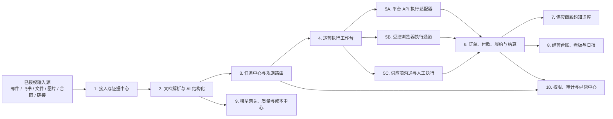
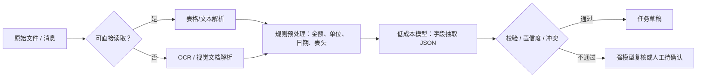
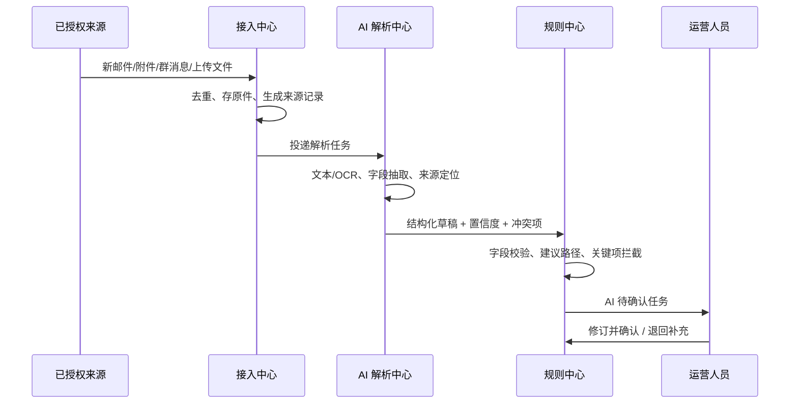
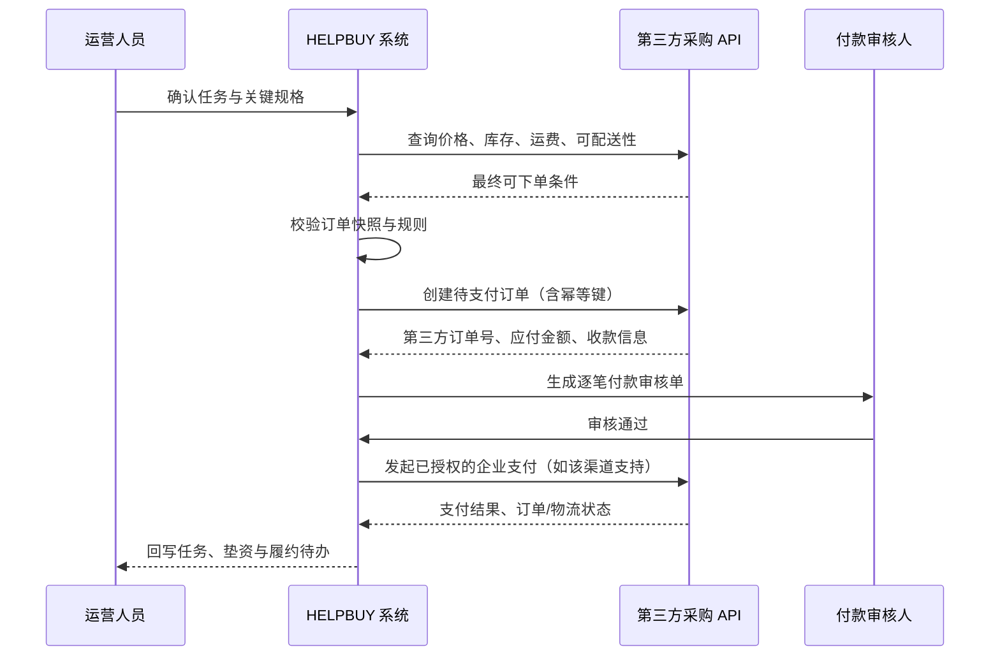
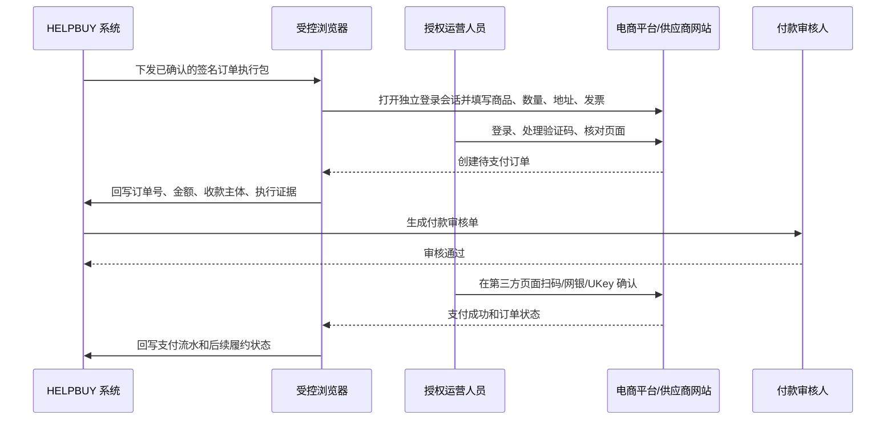
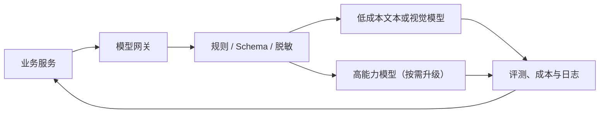

# HELPBUY AI 代采执行平台：产品与技术设计文档

> 版本：V1.0（设计初稿）
> 文档定位：承接《HELPBUY_PRD_V2_商业计划与产品方案》，用于产品、研发、运营和财务共同评审。
> 建设目标：把代采团队的重复执行工作系统化、自动化；不要求客户、供应商或工厂注册使用平台。

---

## 1. 设计结论与边界

### 1.1 一句话架构

HELPBUY 是以**采购任务**为中心的内部运营平台：自动接收非标准需求，以 AI 生成可追溯的任务草稿，由规则和运营人员确认后，按 API、受控浏览器或人工外部沟通三类通道推进下单、付款、履约与结算。

### 1.2 第一阶段的核心取舍

1. **先做运营替身，不做外部交易市场。** 客户、供应商、工厂均不是系统用户；其文件、聊天、订单、报价和回单只是内部证据。
2. **先统一任务与证据，再接更多渠道。** 没有稳定任务底座时，连接越多，混乱越多。
3. **AI 做理解和重复执行，不拥有资金决策权。** AI 可以建议、填单、核验和归档；每笔付款都需要系统审核记录与人类最终放行。
4. **优先 API，受控浏览器兜底。** API 是稳定的系统对系统执行；网页执行是无 API 时的替代路径，不承诺绕过验证码、登录或支付二次确认。
5. **MVP 保持单体模块化。** 先用一套可观测、可审计的应用和异步任务系统跑通单位经济，避免过早微服务化、自建模型或自建 GPU。

### 1.3 不在 V1 范围内的事项

- 客户/供应商注册、实名、门户、在线自助报价或交易市场；
- 无人值守的自动付款；
- 读取未经授权的个人邮箱、个人微信或群聊；
- 绕过第三方平台的登录、验证码、反自动化机制、支付密码或企业网银 UKey；
- 用 AI 对模糊规格作最终判断，或替代财务/授权人的付款责任。

---

## 2. 角色、职责与权限

| 角色 | 平台内主要动作 | 不能做的事 |
| --- | --- | --- |
| 采购运营 | 核对 AI 草稿、补充规格、推进任务、启动受控浏览器、归档履约信息 | 绕过付款规则、修改已锁定付款关键字段后继续支付 |
| 付款审核人/资金负责人 | 审核付款依据、金额、收款主体和资金账户；放行或驳回 | 直接改写原始证据或未授权支付 |
| 总经理/经营负责人 | 查看经营看板、异常、资金暴露、应收和利润 | 无需逐笔处理正常低风险订单 |
| 系统管理员 | 配置内部人员、角色、连接器、阈值、平台 API 密钥和审计策略 | 查看或导出不必要的付款敏感信息 |
| AI | 解析、抽取、比对、建议路径、生成草稿、辅助填单、生成提醒/日报 | 自主付款、自主放行、持有或读取密码/UKey/验证码 |
| 客户/供应商/工厂 | 继续通过原有文件、邮件、聊天、平台订单或电话协作 | 不需要登录 HELPBUY |

### 2.1 权限原则

- **最小权限**：浏览、编辑、审核、支付放行、系统配置均为不同权限点；不以“管理员”取代全部权限。
- **职责分离**：付款发起/资料整理人与付款审核人默认分离；小额例外可由业务规则决定是否允许兼任，但必须留痕。
- **关键字段锁定**：付款审核通过后，外部订单号、应付金额、收款主体、资金账户、付款方式不能静默修改；变化即生成新版本并重新审核。
- **证据优先**：每一个 AI 字段、人工修改、外部执行结果和状态变更都关联来源、操作者、时间和版本。

---

## 3. 总体信息架构与模块划分



| 编号 | 模块 | 核心职责 | V1 优先级 |
| --- | --- | --- | --- |
| 1 | 接入与证据中心 | 接收授权来源、保存原件、去重、建立可追溯证据 | P0 |
| 2 | 文档解析与 AI 结构化 | OCR/文件解析、字段抽取、冲突识别、置信度和待确认项 | P0 |
| 3 | 任务中心与规则路由 | 生成采购任务、拆分子任务、选择路径、状态和 SLA | P0 |
| 4 | 运营执行工作台 | 让一名运营集中处理任务、确认、异常、待办和执行证据 | P0 |
| 5 | 执行通道中心 | API 下单、受控浏览器、供应商沟通/人工执行三种通道 | P0：人工/API 框架；P1：浏览器规模化 |
| 6 | 订单、付款、履约与结算 | 订单、支付审核、垫资、物流、验收、应收和结算 | P0 |
| 7 | 供应商履约知识库 | 由完成订单沉淀供应商表现、价格和履约标签 | P1 |
| 8 | 经营台账、看板与日报 | GMV、服务费、成本、利润、垫资、应收、人效和风险 | P0 |
| 9 | 模型网关、质量与成本中心 | 多模型路由、调用预算、评测、追踪与回退 | P0 |
| 10 | 权限、审计与异常中心 | RBAC、审批、操作日志、字段变更和异常队列 | P0 |

---

## 4. 核心对象与数据模型

### 4.1 设计原则

- 原始输入与 AI 结果分离保存，永远可以回看“AI 为什么这样理解”。
- 一个采购任务可包含多个商品行、多个供应商、多个订单、分批付款和分批发货。
- 任务状态、订单状态、付款状态、履约状态分开建模；不能用一个“已完成”掩盖真实进展。
- 所有金额以分为最小存储单位；币种、税率、含税/未税口径不可省略。

### 4.2 核心实体

| 实体 | 关键字段 | 说明 |
| --- | --- | --- |
| `SourceRecord` 来源记录 | 来源类型、外部消息/文件 ID、采集时间、授权范围、哈希 | 邮件、飞书消息、手工上传、合同、链接等的不可变入口 |
| `EvidenceFile` 证据文件 | 对象存储地址、文件哈希、MIME、OCR 文本、页码/区域定位 | 原件不可覆盖；解析结果可多版本 |
| `ExtractionRun` 解析运行 | 模型/版本、提示词版本、成本、耗时、输出 JSON、置信度 | 记录一次 AI/OCR 工作及可复现上下文 |
| `ProcurementTask` 采购任务 | 客户、优先级、路径、负责人、任务状态、预算、交期 | 运营的主对象 |
| `TaskLine` 采购明细行 | 商品名、品牌、型号、规格、数量、单位、目标价、来源定位 | 一项任务可含多行商品 |
| `SupplierProfile` 供应商档案 | 名称、统一标识、历史履约、税票能力、付款条件、标签 | 内部维护，不对供应商开放 |
| `Quote` 报价 | 供应商、报价行、有效期、税费/运费、原始证据 | 仅询价路径必需 |
| `PurchaseOrder` 采购订单 | 外部平台、第三方订单号、订单金额、收货/发票快照、状态 | 对应一个外部交易或供应商订单 |
| `PaymentIntent` 付款意图 | 订单、应付金额、收款主体、账户指纹、付款方式、状态 | 付款审核的核心对象；不是银行转账指令本身 |
| `PaymentApproval` 付款审核 | 审核人、结论、锁定字段快照、时间、意见 | 每笔付款至少一条通过/驳回记录 |
| `FulfillmentRecord` 履约记录 | 发货、物流、到货、验收、异常、证据 | 支持多批次 |
| `SettlementRecord` 结算记录 | 客户应收、服务费、发票、回款、账龄 | 支撑垫资与利润计算 |
| `AuditEvent` 审计事件 | 主体、动作、前后值、操作者、IP/会话、时间 | 不可变追加日志 |
| `CostLedger` 成本台账 | AI/OCR/搜索/人工分钟/资金占用/履约成本 | 按任务、订单和客户归集 |

### 4.3 采购明细的标准字段合同

AI 每次抽取都要输出结构化 JSON，而非自由文本。每个字段需包含 `value`、`confidence`、`source_refs`、`status` 四部分。

```json
{
  "product_name": {"value": "轴流排风扇", "confidence": 0.96, "source_refs": ["file:page1:line8"], "status": "confirmed"},
  "model": {"value": "XX-300", "confidence": 0.82, "source_refs": ["chat:msg-102"], "status": "needs_confirmation"},
  "quantity": {"value": 12, "unit": "台", "confidence": 0.99, "source_refs": ["file:page1:cell:D5"], "status": "confirmed"},
  "delivery_address": {"value": "成都中心前台", "confidence": 0.93, "source_refs": ["chat:msg-104"], "status": "needs_confirmation"}
}
```

`source_refs` 必须能够定位到文件页码/单元格、邮件、消息或截图区域。低置信度不代表错误，但必须进入待确认清单。

---

## 5. 模块详细设计

### 5.1 接入与证据中心

### 目标

让需求可以来自客户原有工作方式，而不是要求客户填 HELPBUY 模板；同时保证来源合法、可追溯、可去重。

### 输入方式与接入策略

| 输入 | 推荐接入方式 | V1 处理方式 | 注意事项 |
| --- | --- | --- | --- |
| Excel、PDF、图片、合同 | 工作台上传、邮件附件转入、对象存储 | P0 | 保留原件、哈希、页码和上传人 |
| 企业采购邮箱 | OAuth/IMAP 或专用转发邮箱 | P1，先做转发/上传 | 仅接入业务授权邮箱；附件进入病毒扫描与类型校验 |
| 飞书采购群 | 飞书自建应用、机器人或已授权事件订阅 | P1 | 必须由组织管理员授权应用与群范围；保留消息 ID 和附件来源 |
| 企业微信 | 企业自建应用/会话存档等合规能力，取决于企业权限 | P1 | 先确认企业已具备合法留存与接入条件 |
| 个人微信/普通微信群 | 客户转发、导出聊天记录、截图或运营上传 | P0 | 不设计任意个人号/群自动读取能力；避免隐私、账号和合规风险 |
| 商品链接/供应商门户 | 粘贴链接、平台 API 或已授权网页会话 | P0/P1 | 链接只作证据和候选商品来源，不等于可自动下单 |

### 关键流程

1. 连接器按配置周期拉取或接收事件，写入 `SourceRecord`。
2. 用外部 ID、消息/附件哈希、时间窗和内容指纹去重。
3. 文件进入对象存储，完成病毒扫描、类型识别和文本可提取性判断。
4. 产生解析事件，进入异步队列；不阻塞运营工作台。
5. 原始文件与解析结果建立多对多关系：一个合同可产生多笔任务；一笔任务也可引用多份文件/消息。

### 验收标准

- 同一邮件、附件或消息重复到达时不生成重复任务；
- 运营人员可在任务中一键打开原始来源，并定位到关键字段依据；
- 连接器失败、权限过期、解析失败均进入可处理异常队列；
- 不因单个大附件或 OCR 失败阻塞其他需求入池。

### 5.2 文档解析与 AI 结构化中心

### 处理管线



### AI 与程序的职责分界

| 工作 | 首选实现 | 原因 |
| --- | --- | --- |
| Excel 读取、合计、格式和日期校验 | 程序 | 稳定、低成本、可测试 |
| 图片/扫描 PDF 取字 | OCR/视觉文档服务 | 只在无法直接取文本时使用 |
| 非标准字段理解、合同条款、聊天上下文 | 大语言模型 | 适合语义理解，但必须输出约束 JSON |
| 数量单位换算、金额范围、地址完整度 | 规则与字典 | 不应由模型拍脑袋决定 |
| 信息冲突与不确定项 | 规则先发现，模型解释 | 结果必须提示人工确认 |
| 路径选择和付款拦截 | 规则引擎 | AI 只能建议，规则和人做最终决定 |

### 质量控制

- **Schema 校验**：模型输出必须匹配固定数据结构；非法 JSON、无单位数量、非法金额直接失败重试或转人工。
- **交叉校验**：合同金额、采购清单合计、报价单和付款金额不一致时，生成冲突项而不是择一覆盖。
- **关键字段分级**：型号/规格、数量、金额、收款主体、账户、地址、发票信息为关键字段；未确认不得进入相应执行节点。
- **人工修改回流**：记录 AI 初稿与人工最终值的差异，用于提示词、规则、词典和评测集优化；V1 不直接拿生产数据训练基础模型。

### 5.3 任务中心与规则路由

### 任务生成与拆分

AI 解析完成后不是直接“下单”，而是生成 `ProcurementTask` 草稿。运营确认后，系统根据字段完整度和业务规则选择路径：仅代付、电商下单、指定供应商直接采购或询价代采。

拆分规则示例：

- 同一客户的多商品可先留在一笔任务；若供应商、交期、付款方式不同，则拆为多个采购订单；
- 任务可以先进入询价，再转换为直接采购或电商下单；转换必须保留原路径和依据；
- 一张采购订单可以分批发货；每次发货形成独立履约记录；
- 一笔订单可包含多次支付，但每一次支付都建立独立 `PaymentIntent` 和审核记录。

### 任务状态机

```text
草稿 / 待补充
  → 待运营确认
  → 可执行
  → 执行中
  → 履约中
  → 待结算
  → 已完成

任意非终态 → 异常待处理 / 已取消
```

任务状态只表达整体业务进展；下单、付款、物流和结算的细节由子对象状态表达。

### 路由规则示例

| 条件 | 建议路径 | 系统动作 |
| --- | --- | --- |
| 已有供应商、价格、付款信息；不需要采购比价 | 仅代付 | 创建付款依据核验清单 |
| 有商品链接/SKU、规格与收货信息明确 | 电商下单 | 优先匹配 API；无 API 则准备受控浏览器执行 |
| 已有指定供应商但需跟单、发货和验收 | 直接采购 | 创建供应商订单和履约节点 |
| 供应商、价格未定或规格需比对 | 询价代采 | 建报价收集和比较任务 |
| 型号、数量、地址、发票任一关键字段不完整 | 待补充 | 禁止下单；显示字段证据和补充建议 |

### 5.4 运营执行工作台

### 页面结构

1. **今日任务池**：按状态、优先级、截止时间、路径、客户、金额、异常筛选；默认显示每笔“下一步动作”。
2. **任务详情**：左侧原始需求和证据，中间 AI 结构化草稿及可编辑字段，右侧执行动作、审批、订单和日志。
3. **异常队列**：规格不清、金额变化、收款方变化、支付失败、物流逾期、应收逾期等例外。
4. **批量操作**：批量分配、提醒、归档；不支持批量付款放行。

### 一笔任务的最小可视信息

- 原始来源和接收时间；
- 商品行、关键规格、数量、价格、交期、地址、发票；
- AI 置信度、待确认项和人工修改痕迹；
- 当前路径、下一步、负责人、截止时间；
- 订单、付款、物流、验收、应收状态；
- 服务费、AI 成本、人工分钟、资金占用和预计贡献利润；
- 所有关键动作的证据和审计日志。

### 5.5 执行通道中心

### 5.5.1 API 执行适配器

**适用**：具备已签约企业采购 API 的平台，如可接入的京东企业采购/工业品渠道，或具备明确接口能力的供应商。

适配器的统一能力接口：

```text
quote()              查询商品、价格、库存、运费、可配送性
create_order()       创建外部待支付订单
query_order()        查询订单、支付、发货、发票状态
cancel_order()       在平台规则允许时取消未支付订单
start_payment()      仅在审批已通过且渠道支持时发起支付
query_payment()      查询支付结果/余额变动
query_fulfillment()  查询物流或履约状态
```

每个适配器还需声明：支持的付款方式、是否支持发票字段、订单取消时限、幂等键规则、限流规则、回调能力和测试环境情况。

**关键规则：**

- 创建订单时以 HELPBUY 采购订单号作为幂等关联键；网络超时先 `query_order()`，禁止盲目重试创建订单；
- 下单金额、运费、税费、收款主体与任务快照比较，变化时转人工确认；
- `start_payment()` 只能由系统服务在已通过付款审核的前提下调用，AI 无调用权限；
- 所有外部 API 回调或轮询结果均要验签、去重、按事件顺序处理。

### 5.5.2 受控浏览器执行通道

**定义**：一套绑定 HELPBUY 任务的隔离浏览器会话。AI/自动化只能填写经过确认的字段；第三方账号登录、验证码、扫码和网银/UKey 最终支付动作由授权人留在第三方页面完成。

推荐演进路径：

| 阶段 | 形态 | 适用原因 |
| --- | --- | --- |
| MVP | 运营电脑上的受管 Chrome Profile + 浏览器扩展/本地执行器 | 登录、验证码和扫码都在运营人员本机完成；实施成本低 |
| P1 | 专用执行终端或虚拟桌面 + 会话审计 | 适用于多人、账号隔离、交接和统一留痕 |
| P2 | 受控云浏览器池 + 经验证的站点自动化 | 仅在平台允许、稳定性和合规性充分验证后扩展 |

浏览器通道的执行步骤：

1. 工作台生成**签名订单执行包**，仅含已确认的商品、数量、地址、发票和任务 ID；不含密码、验证码或支付密码。
2. 本地执行器校验签名，在目标平台的独立 Profile 中打开页面。
3. 自动化填写字段并暂停，运营人员核对商品规格、数量、金额、地址和发票。
4. 创建第三方待支付订单，读取订单号、应付金额、收款主体和订单截图/结构化回执。
5. 回到 HELPBUY 形成付款审核；审核通过后，运营人员在第三方页面完成扫码、网银或 UKey 确认。
6. 执行器读取成功页/订单状态，将订单号、支付流水、物流订阅结果回写任务；人工可补传凭证。

**绝对禁止：** 将第三方登录页嵌入 iframe、向模型发送 cookie/密码、自动点击支付二次确认、绕过验证码或反爬策略。

### 5.5.3 供应商沟通与人工执行

对直供工厂、线下供应商或暂未接入的平台，系统生成标准执行包：询价单、采购订单草稿、付款通知、催货消息和验收清单。运营人员仍用既有邮件、飞书、企业微信或电话发送；回执通过上传、转发或连接器归档。

目标不是强迫工厂改用 HELPBUY，而是让运营人员无需重复整理信息和台账。

### 5.6 付款、垫资与结算中心

### 付款状态机（独立于任务状态）

```text
未创建付款意图
  → 待付款资料核验
  → 待付款审核
  → 已批准待执行
  → 支付处理中
  → 支付成功 / 支付失败 / 已撤销
  → 已对账
```

### 每笔付款的强制校验

| 校验项 | 规则 |
| --- | --- |
| 付款依据 | 必须关联采购订单、合同/报价/客户指令中的至少一类证据 |
| 金额 | 付款金额不得超出已审核订单应付金额；差异进入异常 |
| 收款主体 | 与订单/合同/历史已验证信息比对；变化需重新审核 |
| 资金账户 | 使用内部资金账户白名单和权限；不向 AI 暴露密钥或网银凭证 |
| 重复支付 | 以外部订单号、收款账户指纹、金额、时间窗和支付流水多维去重 |
| 客户风险 | 按客户可用额度、逾期应收、垫资上限和订单利润提示例外 |
| 审批版本 | 审批通过后关键字段变化，旧审批自动失效 |

### 支付模式

1. **平台企业余额/账期/API 支付**：审核通过后，系统使用平台授予的受限授权调用支付接口；仍需保留每单审核证据。
2. **第三方网页支付**：系统创建待支付订单并审核；授权人通过扫码、企业网银或 UKey 完成最终确认。
3. **供应商银行转账**：系统生成付款申请和财务核对资料；真正银行支付由企业财务系统/网银完成，回单再归档对账。

### 垫资与客户结算

- 每一笔支付成功即形成垫资台账，记录本金、开始日期、预计回款日、资金成本率和实际回款；
- 客户应收与供应商应付分开记录；不得仅以“订单完成”推断已收款；
- 服务费、税费、退款、补发和售后均应能影响单笔贡献利润；
- 看板实时展示在途垫资、到期应收、逾期应收和可用资金占用。

### 5.7 履约、供应商知识与经营看板

### 履约

记录下单、支付、发货、物流、到货、验收、售后和结算事件。物流可由 API/网页回写、人工上传或运营更新；系统只将有证据的数据标记为“已确认”。

### 供应商知识

供应商档案由完成订单沉淀：可供品类、历史价格、响应时间、交期承诺、实际妥投、售后、税票和付款条件。AI 可以建议标签，但最终标签必须能追溯到历史订单与证据。

### 经营看板指标

- 订单与 GMV：新增、完成、在途、异常、超期订单数及金额；
- 收入与利润：服务费、实际费率、人工/AI/资金/履约成本、贡献利润；
- 资金：在途垫资、可用额度、应收、账龄、逾期；
- 人效：每运营人员订单量、单笔人工分钟、从接收至可执行/下单/付款的耗时；
- AI：字段准确率、人工修改率、强模型升级率、每单 AI 成本、失败率；
- 风险：待付款、付款失败、收款方变化、规格待确认、履约超期和低利润订单。

---

## 6. 核心业务流程

### 6.1 自动采集到任务确认



**效率来源：** 运营不再从聊天和附件中手工抄写信息；只处理低置信度、冲突和关键规格。

### 6.2 API 下单与付款流程



**失败处理：** 下单或支付超时先查询第三方订单/支付状态，不允许因重试而重复下单或重复付款。

### 6.3 无 API 的受控浏览器下单与付款流程



**效率来源：** 机器填表、机器记录、机器对账；人只处理登录、验证码、关键核对和付款确认。

### 6.4 仅代付流程

1. AI 从客户指令、合同、报价和供应商收款资料中形成付款草稿；
2. 规则校验订单依据、金额、收款主体、账户变化、客户应收和资金额度；
3. 运营核对关键字段，资金负责人逐笔审核；
4. 根据支付通道执行企业余额/API 支付或财务/网银支付；
5. 回单、支付流水、客户应收和垫资信息进入结算台账。

仅代付不是“只要客户说了就付款”：它是风险最高的路径之一，必须保留强证据和逐笔审核。

---

## 7. AI 技术路线与成本控制

### 7.1 推荐架构：模型网关而非单一模型绑定



模型网关应统一提供：

- 模型供应商适配、版本选择、限流、重试与故障回退；
- 提示词模板版本管理；
- JSON Schema/工具调用约束；
- 上下文裁剪、文件引用、缓存和脱敏；
- 每次调用的 token、OCR、搜索、耗时、错误码和任务归属；
- 离线评测与人工修订对比。

### 7.2 路由原则

| 场景 | 首选策略 | 升级条件 |
| --- | --- | --- |
| 常规 Excel/文本清单 | 程序解析 + 低成本文本模型 | 字段缺失、表头异常、信息矛盾 |
| 图片、扫描件、聊天截图 | OCR/视觉模型 + 规则 | OCR 低置信、表格错位、关键字段无法定位 |
| 合同、长聊天记录 | 切片、摘要、检索定位后使用文本模型 | 条款冲突、金额/交期难以确认 |
| 非标规格比对 | 规则+历史知识，再用强模型解释 | 候选规格冲突或高金额订单 |
| 付款和路径动作 | 规则引擎 | AI 不做最终决定 |

### 7.3 单笔成本护栏

```text
单笔 AI 全成本 = OCR/文档解析 + 模型调用 + 搜索/网页数据 + 存储与队列分摊 + 错误返工分摊
AI 成本率 = 单笔 AI 全成本 / 单笔服务收入
```

实施机制：

- 每条路径设定解析预算、强模型调用次数和最大单笔成本；
- 同一文件只解析一次，后续任务复用结构化结果；
- 传给模型的是必要片段、字段和来源定位，不重复发送完整聊天记录；
- 先用规则查历史供应商、地址和发票模板，再请模型补充；
- 超预算任务自动降级为“待人工处理”，而不是无限重试；
- 每周按订单类型复盘“AI 成本、节省人工分钟、人工修改率、利润贡献”。

### 7.4 AI 质量指标

| 指标 | 定义 | V1 建议用途 |
| --- | --- | --- |
| 字段准确率 | AI 值与人工最终值一致的字段占比 | 按商品、规格、数量、金额等字段分别统计 |
| 关键字段漏识别率 | 应出现但未被识别的关键字段比例 | 作为下单/付款前护栏指标 |
| 人工修改率 | 被人工改写的字段数 / AI 已输出字段数 | 判断哪类输入不适合自动化 |
| 可执行草稿率 | 首次解析后仅需轻微修改即可确认的任务比例 | 衡量真实人效价值 |
| 单笔 AI 成本 | 关联该任务的全部 AI 类调用成本 | 与服务费、人工节省一起判断 ROI |
| 解析耗时 | 输入进入任务池所需时间 | 控制运营等待体验 |

---

## 8. 开发技术路线

### 8.1 MVP 推荐技术栈

| 层级 | 建议 | 选择理由 |
| --- | --- | --- |
| 前端 | React + Next.js + TypeScript | 适合工作台、看板、表单和文件预览；与现有 Demo 技术一致 |
| 后端业务 API | TypeScript（NestJS/Fastify 等模块化服务框架） | 与前端共享类型、团队上下文少、便于快速迭代 |
| 异步任务 | Redis 队列 + Worker；规模化后评估工作流引擎 | 文件解析、连接器、回调、轮询和日报均不应占用 Web 请求 |
| 主数据库 | PostgreSQL | 事务、审计关联、状态机、财务台账和报表需要强一致关系数据 |
| 文件证据 | 兼容 S3 的对象存储 | 保存原件、版本、回单和截图；数据库只保存元数据与引用 |
| 缓存/限流 | Redis | 队列、分布式锁、幂等、会话和 API 限流 |
| 检索 | PostgreSQL 全文检索优先；知识库规模扩大再评估向量检索 | V1 不应为少量数据过早引入复杂向量基础设施 |
| AI/OCR | 可替换的模型网关与文档解析适配层 | 防止绑定一家模型或 OCR 供应商 |
| 浏览器执行 | Playwright/CDP 适配层 + 本地浏览器扩展/执行器 | 先把登录和支付确认留在运营电脑，降低账号和验证码复杂度 |
| 可观测性 | 结构化日志、错误追踪、指标监控、分布式追踪 | 必须定位一笔订单在哪一步失败、耗时和花费多少 |
| 部署 | 容器化 + 托管数据库/对象存储/密钥服务 | 不自建 GPU；先用托管云能力降低运维负担 |

### 8.2 为什么 V1 不建议微服务

V1 的关键风险是业务规则未稳定，而不是单点性能不足。过早拆为订单、支付、AI、供应商、报表等独立服务，会增加事件一致性、部署、排查与团队协作成本。建议采用**模块化单体 + 异步 Worker**：代码层严格划分模块边界，运行层先保持简单；当连接器数量、支付通道或团队规模达到明确阈值后再拆分。

### 8.3 推荐工程边界

```text
apps/
  web/                   运营工作台与经营看板
  api/                   鉴权、业务 API、审批与查询
  worker/                解析、连接器、回调、轮询、日报
packages/
  domain/                任务、订单、付款、履约等领域模型与状态机
  connectors/            邮件、飞书、平台 API、浏览器适配器
  ai-gateway/            模型、OCR、提示词、Schema、成本计量
  rules/                 路由、付款、异常、客户额度规则
  audit/                 审计事件和证据链
  ui/                    复用组件与设计规范
```

### 8.4 环境与发布策略

- 至少区分开发、测试、生产环境；第三方 API 和支付能力不得在开发环境使用生产凭据；
- 每个外部平台适配器使用沙箱或小额白名单订单验证；
- 数据库结构迁移、规则版本、提示词版本和浏览器脚本版本均可追溯、可回滚；
- 生产发布采用灰度：先限定客户、平台、订单金额与运营人员范围；
- 付款相关变更必须通过测试用例、双人代码评审和上线后监控。

---

## 9. 关键技术难点与应对方案

| 难点 | 为什么难 | 设计应对 | V1 验收信号 |
| --- | --- | --- | --- |
| 非标准文件与聊天输入 | 规格散落在 Excel、合同、图片和聊天中，单位/简称不一致 | 原件留存、字段来源定位、Schema、规则校验、待确认项 | 关键字段可回溯；运营不需重新翻找原文 |
| 多来源信息冲突 | 合同、聊天、报价和付款单金额/型号可能不同 | 不自动覆盖；生成冲突卡片与版本对比；关键项禁止流转 | 冲突可见且必须被确认/驳回 |
| 聊天渠道接入 | 各 IM 的权限、管理员授权和数据留存能力不同 | 优先官方/企业授权接口；个人微信采用转发、导出、截图，不做私自监听 | 权限过期与接入范围可见、可撤销 |
| 非标商品匹配 | 名称相同不代表型号、参数、安装尺寸相同 | 将型号/规格定义为关键字段；AI 只建议，不确定即拦截 | 错规格进入下单前被拦截 |
| 平台 API 参差不齐 | 接口权限、支付方式、回调、订单状态不同 | 统一适配器契约；每平台能力清单；API 优先、浏览器兜底 | 新渠道不改核心订单/付款逻辑 |
| 网页自动化脆弱 | 页面改版、验证码、动态价格、反自动化和登录会导致脚本失败 | 本地受控浏览器、页面脚本版本、人工接管、只自动化填单不绕过安全动作 | 失败可安全暂停，不产生重复订单/付款 |
| 下单/付款幂等性 | 网络超时可能“平台已成功、系统未收到结果” | 客户订单号、外部订单查询优先、分布式锁、支付流水去重 | 任何重试不重复下单/重复付款 |
| 付款责任与资金风险 | 自动化易把错误放大 | 付款意图独立状态机、关键字段锁定、每单审核、人工最终确认 | 0 笔未审核付款；全部可追溯 |
| 对账与异步履约 | 支付、发货、签收和客户回款跨多天、多系统 | 事件模型、轮询/回调、异常队列、对账任务 | 每笔垫资都有状态、账龄和证据 |
| AI 幻觉与成本失控 | 非标需求中 AI 可能编造或反复调用 | 证据引用、Schema、规则、调用预算、人工修订反馈 | AI 成本率与人工节省可按路径计算 |
| 敏感数据与凭据 | 合同、地址、发票、账户、聊天和浏览器会话均敏感 | 数据分类、加密、最小权限、密钥库、审计、脱敏给模型 | 无密码/UKey/验证码进入模型或业务数据库 |

---

## 10. 安全、合规与审计设计

### 10.1 数据分级

| 级别 | 示例 | 控制要求 |
| --- | --- | --- |
| 一般业务数据 | 商品名、数量、公开链接 | 常规访问与审计 |
| 内部经营数据 | 服务费、成本、利润、客户订单 | 角色访问、导出控制 |
| 个人/企业敏感信息 | 地址、联系人、发票抬头、合同 | 加密存储、最小可见、访问留痕 |
| 高敏感资金信息 | 银行账户、支付回单、额度、支付 API 凭据 | 字段掩码、密钥库、审批访问、禁止送入模型 |
| 认证要素 | 密码、Cookie、验证码、UKey、短信口令 | 不入库、不入日志、不入模型；仅保留在第三方或受管本地浏览器环境 |

### 10.2 审计最小集合

- 来源进入、原件版本、解析运行、模型与提示词版本；
- AI 输出、人工修改前后值、确认/驳回理由；
- 下单请求、外部订单号、回调、失败和重试；
- 付款意图、审核快照、放行、支付结果、回单与对账；
- 权限授予、连接器授权/撤销、敏感数据查看与导出。

### 10.3 付款安全红线

- 任何付款必须存在对应的采购订单/合同/客户指令证据；
- 任何真实支付必须存在审批通过的 `PaymentApproval`；
- AI 服务账号没有支付 API 调用权限；由受限的支付执行服务验证审批令牌后调用；
- 支付凭据使用专门密钥服务保存，不出现在应用配置、日志、模型上下文或浏览器自动化参数中；
- 对外部账户变更、金额上调、支付失败重试、退款等情况定义显式人工复核策略。

---

## 11. 三阶段研发路线图

### 阶段一：运营替身 MVP（目标：验证单笔人效与单位经济）

**建设重点**

- 文件/图片/手工聊天导入、证据中心和 AI 结构化草稿；
- 四类任务路径、任务工作台、轻量规则、订单/付款/履约台账；
- 逐笔付款审核、人工支付回单归档；
- 模型网关、成本计量、经营看板和日报；
- 选定一个 API 渠道做试点；受控浏览器仅做受管 Profile + 人工接管演示。

**阶段门槛**

- 用 50–100 笔历史/真实样本完成评测；
- 关键字段准确率、人工修改率、单笔 AI 成本和人工分钟均可量化；
- 无未审付款、无重复下单/重复付款事故。

### 阶段二：可复制运营（目标：扩大接单量而不同比例增加人员）

**建设重点**

- 邮件、飞书等已授权连接器；多人任务池、分配、交接和 SLA；
- 平台 API 适配器扩展、支付和订单回调；
- 受控浏览器本地执行器、字段填单、人工接管和会话审计；
- 供应商履约标签、客户等级、动态服务费和异常队列；
- 经营产能预测：订单量、客单、路径结构、AI 成本、人工时间、垫资和利润。

### 阶段三：规模化经营（目标：形成标准化代采运营能力）

**建设重点**

- 多业务实体、精细化额度/账期/应收风险规则与财务/ERP 对接；
- API 与浏览器通道的稳定性治理、更多供应商履约数据；
- AI 质量监控、策略实验、专用模型/私有化的 ROI 评估；
- 多区域、多团队经营看板、自动对账和预测模型。

---

## 12. 测试与验收计划

### 12.1 样本集

建立不少于 100 笔脱敏订单的基准集，覆盖：Excel 清单、合同、扫描件、聊天截图、邮件、仅代付、电商下单、指定供应商和询价任务。每笔由业务人员标注最终正确字段、路径、证据、实际人工分钟和结果。

### 12.2 必测场景

| 类型 | 必测情形 |
| --- | --- |
| 解析 | 多页合同、模糊图片、混合单位、多个商品行、价格区间、缺失地址、同名不同型号 |
| 冲突 | 合同与聊天数量不同、报价与下单金额不同、收款主体变化、发票信息缺失 |
| 下单 | API 超时后查询成功、重复点击、价格变化、库存不足、取消未支付订单 |
| 付款 | 审批前禁止支付、审批后金额变化失效、重复支付拦截、支付处理中断、回单缺失 |
| 浏览器 | 页面元素变化、验证码、人工接管、会话失效、执行结果无法读取 |
| 权限 | 越权查看、越权审核、敏感字段掩码、审计完整性、连接器授权撤销 |
| 成本 | 大文件、重复附件、模型降级、强模型预算耗尽、批量日报 |

### 12.3 MVP 验收口径

- 运营可从原始输入到“可执行任务”完成端到端处理；
- 每个关键字段都可定位来源，人工修改可追溯；
- 每笔付款均有付款意图、审批与回单/结果记录；
- 下单和支付重试不会产生重复外部交易；
- 管理者可看到订单、GMV、服务费、人工/AI/资金成本、预计利润、垫资与应收；
- 试点订单的人均处理能力或单笔人工分钟相较人工基线有可量化改善，且 AI 成本不吞噬目标服务费毛利。

---

## 13. 研发启动前的待决策事项

1. 首批试点客户、订单类型、金额上限和服务费底线；
2. 首个正式接入的采购平台/API，以及可获得的企业账号、沙箱、支付方式和合同权限；
3. 采购邮箱、飞书群、企业微信等各来源的授权主体、可接入范围和数据留存政策；
4. 付款审核角色、金额阈值、客户额度、垫资上限和异常升级规则；
5. 真实支付由平台余额/API、企业网银、财务系统还是组合方式完成；
6. 第三方模型/OCR 的数据处理、地域、保留和脱敏要求；
7. 历史订单样本的脱敏方式、人工标注责任人与验收指标基线；
8. 受控浏览器首批站点、账号归属、运营终端管理方式及第三方平台许可边界。

---

## 14. 推荐的下一步

1. 先以 20 笔真实但脱敏的“电商下单 + 仅代付”订单做字段与流程走查；
2. 固化采购明细 JSON Schema、任务/订单/付款状态机和付款审核字段，这是研发的第一批接口合同；
3. 同时确认一个官方 API 渠道与一个无 API 网页渠道，验证两条执行通道；
4. 以真实人工分钟、AI 成本、资金占用和服务费建立试点利润看板；
5. 在结果达标后，再接入邮件/飞书自动采集和受控浏览器规模化能力。
